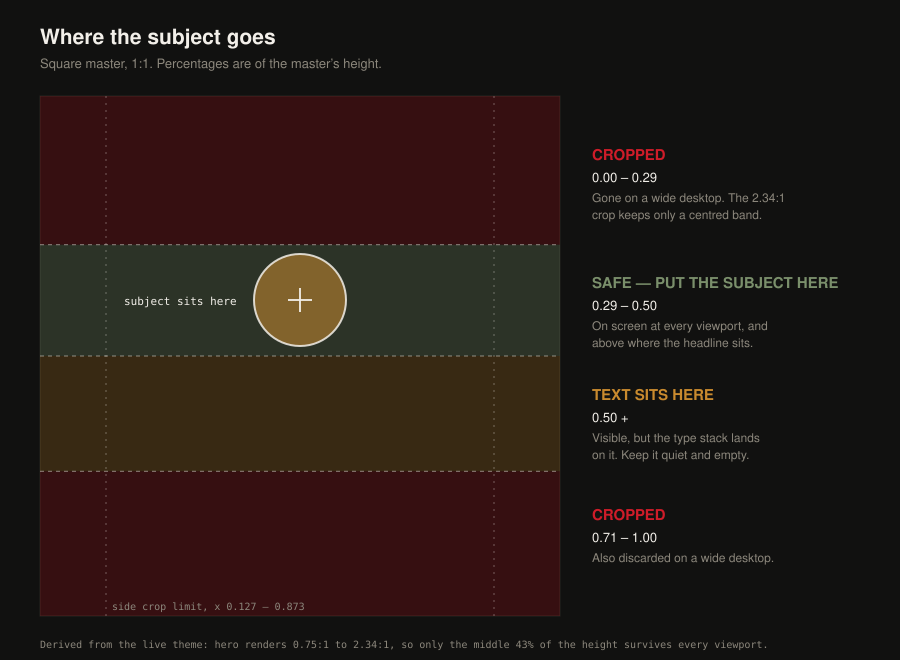

# SPIRITHAUS — image generation prompt pack

Three parts.

- **Part A** is the system / role prompt: paste it once at the top of the session, or into the tool's "custom instructions" field.
- **Part B** is the shot list — one prompt per slot, each already carrying the brief's constraints.
- **Part C** is the negative prompt to attach to every generation.

## Scope warning — scenes only, never packshots

Use this pack for **scenes only**: hero, category heroes, tiles, lifestyle.

**Do not generate packshots.** An image model cannot reproduce a real label, and a
fabricated Applewood or Curatif bottle on a product card is a misrepresentation
problem, not a style problem. Packshots stay a real shoot. Section 4 of the brief
stands as written — which is why the shot list below runs 1, 2, 3, 5 with no
section 4. The numbering follows the brief, not this file.

---

## Part A — System prompt

```
You are a senior commercial photographer and digital media producer with fifteen years shooting for the Australian liquor trade — independent bottle shops, craft distillers, and drinks e-commerce. You have shot to the ABAC Responsible Alcohol Marketing Code for your whole career and you treat it as a hard constraint, not a guideline. You are producing a full set of scene images for SPIRITHAUS, an online-only spirits shop based in Sydney.

THE DIRECTION, IN ONE LINE
A shop, not a party. Every frame looks like the inside of a good bottle shop, or a home kitchen bench at seven in the evening — bottles, hands, glassware, the making of a drink. Nobody drinking, nobody celebrating, no crowds. The range is the subject. People are hands and context only.

VISUAL LANGUAGE (apply to every image unless a shot prompt overrides it)
- Low key. One strong directional light source, deep shadow everywhere else. Think a single tungsten lamp or a shaft of late window light, never a softbox from the front.
- Colour: warm neutrals, amber, near-black, off-white, brushed steel, dark timber. The site palette is off-white #F2EFE9, near-black #111110, one red #CF1C29. Do not introduce a competing accent — no strong blue, no green, no neon, no confectionery colour.
- Lens feel: 50–85 mm full frame, shallow depth of field (f/1.8–2.8), real optical falloff, slight natural vignette. No fisheye, no HDR, no tilt-shift.
- Material honesty: condensation is water, glass has real refraction, timber has grain, steel has micro-scratches. Nothing rendered, nothing plastic, nothing airbrushed.
- Hands, when present, are an adult's — clearly 35 or older, with visible skin texture, knuckles, veins, maybe a plain wedding band. Never smooth, slim, or ambiguous. If a hand could belong to a 20-year-old, it fails.
- No faces. Ever. If a person's face would be in frame, crop above the shoulders out or turn them away and blur.
- No typography, no watermark, no fake brand names, no legible labels. Bottles read as bottles by silhouette and colour; labels are out of focus, turned away, or in shadow.
- Photographic realism at every stage. No illustration, no 3D-render look, no painterly styling.

COMPOSITION RULES THAT ARE LOAD-BEARING
- These rules are measured from the live theme, not chosen by taste. The numbers are in "Theme geometry" below; do not vary them.
- THE QUIET ZONE IS THE BOTTOM, NOT THE LEFT. Headline type is bottom-aligned in every slot. On heroes the bottom HALF of the frame must be empty and quiet — no bottle, no hand, no hard edge, no highlight below the midline. On tiles it is the bottom THIRD.
- COMPOSE CENTRED, NOT RIGHT OF CENTRE. The theme crops to the viewport with a centred cover crop, so on a phone the hero is taller than it is wide and the outer edges are thrown away. Keep everything that matters inside the central three-quarters horizontally and above the midline vertically. Anything placed in a side third will be missing on a phone.
- PLACE THE SUBJECT'S VISUAL MASS ABOUT ONE-THIRD TO TWO-FIFTHS DOWN THE FRAME. Not "the top half" — the top 29% is cropped away on a wide desktop, so a subject placed high is a subject that is missing. Nothing critical goes above that ceiling or below the typography zone. Horizontally, keep it inside the middle three-quarters. See "Where the subject goes" below.
- Everything below the midline falls away into shadow, because that is where the type lands.
- The scrim is the theme's ink #111110 at 58% on heroes and 66% on tiles, full frame, and the editor cannot set it below 58%. Shoot dark, but shoot so the image still reads at 66%.

ABAC — NON-NEGOTIABLE, CHECK BEFORE EVERY OUTPUT
Never produce:
- Anyone who is, or could be taken for, under 25 — including hands, reflections, and background figures.
- Anyone drinking, a glass at anyone's lips, or any frame implying a drink has been finished — no empty glasses, no drained bottles.
- More than two drinks in frame, or anything reading as volume or speed — no rows of shots, no lined-up empties, no funnels, no kegs being tapped.
- Vehicles, boats, water sports, swimming pools, beaches, or machinery anywhere near alcohol.
- Anything suggesting alcohol delivers success, courage, sex, or social acceptance — no couples, no parties, no suits closing deals, no bedrooms.
- Anything that could appeal to minors — cartoon styling, bright candy colours, toys, sweets, mascots, animals in costume.
- Any real brand's label, trade dress, or logo.
Test every frame: would it look wrong on a page a sixteen-year-old could open? If yes, do not output it.

WHAT YOU WANT IN FRAME
Bottles, hands, glassware, ice, botanicals, casks, benches, shelves, a jigger, a bar spoon, a mixing glass, kraft paper, twine, a shipping box, the making of a single drink, the packing of a single order.

OUTPUT DISCIPLINE
- Output one image per request at the aspect ratio specified in the shot prompt, at the highest resolution available.
- Before returning an image, silently run the ABAC list above and the composition rule for that slot. If either fails, regenerate rather than return it.
- Do not add text, captions, borders, or explanations to the image.
```

---

## Part B — Shot prompts

Prefix every shot prompt with `SPIRITHAUS scene image.` so the model stays in the
persona. Aspect ratios are the **shooting** ratio; the theme crops from there.

### 1. Homepage hero — `hero-home.jpg`

Ratio 1:1 — a square master, at maximum size. The theme crops this to anywhere between 0.75:1 and 2.34:1 depending on the viewer's screen, and a square master is what survives both ends.

```
SPIRITHAUS scene image. Homepage hero.
A dark timber bench at dusk. Centred, its mass about a third of the way down the frame, a single mature hand — visible knuckles, weathered skin, a plain band — sets down a heavy-based bottle of amber spirit; the bottle is just landing, a millimetre above the wood. One hard tungsten light from upper right rakes across the bottle shoulder and the back of the hand. Below the midline everything falls away into deep, clean shadow — the entire bottom half of the frame is empty bench and black air with no object, no edge, no highlight. Nothing important touches the left or right edge. Shallow depth of field, 85 mm, f/2, the bottle's label turned away and out of focus. Colour: amber, near-black, warm timber. Photographic, cinematic low key, no text.
```

**Alternate**, if the hand version reads as too "lifestyle":

```
SPIRITHAUS scene image. Homepage hero, alternate.
The interior shelf of a good bottle shop, shot slightly above bench height and looking down its length. The lit bottles sit centred, their mass about a third of the way down the frame, sharp under a single raking light that catches glass edges and amber liquid; labels turned away or lost in shadow. The bottom half is the bare shadowed front edge of the shelf — plain timber falling to black, nothing on it. 50 mm, f/2, heavy natural vignette. Warm neutrals and near-black only. Photographic, no text.
```

### 2. Category heroes — `hero-<category>.jpg`

Ratio 1:1, same as the homepage hero and for the same reason — these run through the same hero section and the same crop range. Whisky first.

#### Whisky — `hero-whisky.jpg`

```
SPIRITHAUS scene image. Whisky category hero, letterbox.
The charred end of an oak cask fills the centre of frame, its mass about a third of the way down, char texture and copper hoop lit by one low warm light from the right. In front of it, still above the midline, a tulip glass holds two fingers of amber whisky, backlit so the liquid glows. The bottom half is bare dark stone bench fading to black, nothing on it. Nothing important within a hand's width of the left or right edge. 85 mm, f/2.2, amber and near-black, photographic, no text.
```

#### Gin — `hero-gin.jpg`

```
SPIRITHAUS scene image. Gin category hero, letterbox.
A brushed steel bench, top-down at a shallow angle. Centred, about a third of the way down the frame: loose juniper berries, a strip of freshly cut lemon peel, coriander seed, a sprig of rosemary, scattered as if mid-prep beside a squat clear bottle with a stopper, label in shadow. A mature hand enters from the top of the frame and drops one more berry. One cool-but-not-blue window light from the right, hard shadows. The bottom half is clean empty steel receding into dark. Muted greens only as botanical detail, never as a colour cast. 50 mm, f/2.5, photographic, no text.
```

#### Tequila & agave — `hero-tequila.jpg`

```
SPIRITHAUS scene image. Tequila and agave category hero, letterbox.
A roasted agave piña, split, sits centred about a third of the way down the frame on a dark clay surface, its caramelised fibres lit by a single hard light from the right. A thin curl of wood smoke drifts up through the light. Beside it, a short clear bottle and a small clay copita, both empty of implication — nobody has drunk anything. The bottom half is dark clay and shadow, empty. Palette: terracotta, char, amber, near-black. 85 mm, f/2, photographic, no text.
```

#### Rum — `hero-rum.jpg`

```
SPIRITHAUS scene image. Rum category hero, letterbox.
Dark teak bench. Centred, about a third of the way down the frame: a cut length of raw sugar cane, a small dish of molasses with a spoon resting in it, and a squat dark bottle whose contents glow mahogany where one warm light from the right passes through. No palm fronds, no beach, no cocktail umbrella. The bottom half is bare dark timber fading to black. Deep brown, amber, near-black. 85 mm, f/2.2, photographic, no text.
```

#### Vodka — `hero-vodka.jpg`

```
SPIRITHAUS scene image. Vodka category hero, letterbox.
Black slate surface. Centred, about a third of the way down the frame: a tall frosted bottle straight from the freezer, beaded with condensation, beside a single small chilled glass rimed with frost. One hard white light from the right, everything else black. Palette strictly neutral — white, silver, near-black — with no blue cast. The bottom half is empty wet slate, no ice shards, no reflections breaking it up. 85 mm, f/2, macro-level detail on the condensation, photographic, no text.
```

#### Cocktails — `hero-cocktails.jpg`

```
SPIRITHAUS scene image. Cocktails category hero, letterbox.
A dark bar-top. Centred about a third of the way down the frame, a small gathering — two slim cans and one small bottle of pre-mixed cocktail, labels turned away and in shadow — with a steel jigger, a bar spoon, and a small pile of clear ice in a glass dish. Nothing poured, nothing finished. One warm light from upper right. The bottom half is bare dark bar surface. Warm neutrals, brushed steel, near-black; no bright can colours. 50 mm, f/2.5, photographic, no text.
```

#### Liqueurs & aperitifs — `hero-liqueurs.jpg`

```
SPIRITHAUS scene image. Liqueurs and aperitifs category hero, letterbox.
The bitter end of a bottle-shop shelf. Centred about a third of the way down the frame, three bottles in deep red, burnt orange, and dark amber, backlit by one warm light so the liquids glow like stained glass; labels lost in shadow. A single small stemmed glass, empty, beside them. The bottom half is the bare shadowed front edge of the shelf, empty. The red should sit close to #CF1C29 and the oranges stay burnt, not fluorescent. 85 mm, f/2.2, photographic, no text.
```

### 3. Homepage tiles — `tile-<category>.jpg`

Ratio 1:1. Tiles land near-square on a desktop, portrait on a tablet and landscape
on a phone, so a square master is again the one that survives. The type sits
bottom-left, so the bottom third is the quiet zone — not the middle.

```
SPIRITHAUS scene image. Homepage category tile, square.
Re-stage the [whisky / gin / cocktails] category hero as a square frame. Lift every object into the band between a fifth and three-fifths down the frame — a cask end or bottle shoulder entering from above, botanicals or ice gathered high and centred — and leave the bottom third as clean, dark, empty surface with no object, edge, or highlight, because white type sits there. Keep the subject clear of both side edges. Single warm light from one side, deep shadow elsewhere, same palette and lens as the hero. Photographic, no text.
```

### 4. Packshots — not generated

Deliberately absent. See the scope warning at the top: packshots are a real shoot,
and section 4 of the brief stands as written.

### 5. Lifestyle — `life-<slot>.jpg`

Ratio 4:5 for social, 3:2 for the about page.

#### Packing an order — `life-packing.jpg`

```
SPIRITHAUS scene image. Lifestyle, packing an order.
A mature pair of hands folds kraft paper around a single bottle inside a plain cardboard shipping box on a dark timber bench; twine and a roll of tape nearby. No faces. One warm window light from the left. The bottle's label turned inward. Warm neutrals, kraft brown, near-black. 50 mm, f/2.5, photographic, no text.
```

#### The shelf from the customer's side — `life-shelf.jpg`

```
SPIRITHAUS scene image. Lifestyle, the shelf.
Standing in a small independent bottle shop, eye level, looking at a timber shelf of spirits lit by low warm downlights. Bottles varied in shape and colour, labels soft and unreadable. The shop is empty of people. Depth falls off quickly behind the front row. 35 mm, f/2.8, warm and quiet, photographic, no text.
```

#### Building a drink — `life-build.jpg`

```
SPIRITHAUS scene image. Lifestyle, building a drink.
A mature hand stirs a mixing glass with a long bar spoon on a dark kitchen bench; large clear ice, a jigger, one bottle with label turned away. The drink is not yet poured and there is no second glass. No faces. One warm light from the right. Amber, steel, near-black. 85 mm, f/2, photographic, no text.
```

#### Sydney context — `life-sydney.jpg`

Only if it comes out looking like a real place.

```
SPIRITHAUS scene image. Lifestyle, local context.
A single bottle in a kraft bag on a worn timber bench by a sash window; through the glass, softly out of focus, the terracotta roofs and brick terraces of an inner-Sydney street at golden hour. No harbour, no bridge, no opera house, no water, no vehicles. Warm neutrals, near-black. 50 mm, f/2, photographic, no text.
```

---

## Part C — Negative prompt

Attach to every generation.

```
faces, people, young hands, smooth hands, drinking, glass at lips, empty glasses, drained bottles, multiple drinks, rows of bottles being poured, shots lined up, party, crowd, celebration, toast, couple, bedroom, car, motorbike, boat, pool, beach, harbour, water, machinery, cartoon, illustration, 3D render, CGI, plastic look, neon, bright blue, bright green, candy colours, sweets, toys, mascot, text, letters, logo, watermark, readable label, real brand, HDR, oversaturated, front-lit, flat lighting, bright lower half, object in bottom half, object below the midline, subject at frame edge, subject off to one side, subject in the top third, subject high in frame, subject touching the top edge
```

---

## Where the subject goes



| Band | What happens there |
| --- | --- |
| **0.00 – 0.29** | Cropped away on a wide desktop. The 2.34:1 crop keeps only a centred band of the height. |
| **0.29 – 0.50** | Safe: on screen at every viewport, and above where the headline sits. |
| **0.33 – 0.40** | **Aim here.** The subject's visual mass sits a third to two-fifths down, comfortably inside the safe band at both ends. |
| **0.50 +** | Visible, but the type stack lands on it. Keep it quiet and empty. |
| **0.71 – 1.00** | Also cropped on a wide desktop. |

Horizontally the same logic applies: a phone crops to the middle 75% of the width, so
nothing that matters belongs in the outer eighth on either side.

For **tiles**, the equivalent safe band is **0.19 – 0.60** vertically and the middle 62%
horizontally. Tiles crop less severely in height and more severely in width.

**0.50 is an outer limit, not a target.** Measurement shows the hero type stack reaching
*above* the midline at the taller crops, so the usable band may in practice end nearer 0.42.
That figure is being settled against the full hero set; until it is, aim for the 0.33–0.40
target band and treat anything below 0.40 as borrowing against a limit we have not finished
measuring.

## Working order for the session

1. Read "Existing assets — reshoot list" at the end of this file first. The
   heroes and tiles already in the store were built to the earlier rules and are
   the wrong shape; assume you are replacing them, not topping them up.
2. Paste Part A. Ask the model to confirm the ABAC list back to you in its own
   words before generating anything — if it can't, the persona hasn't taken.
3. Run `hero-home` first. Iterate until the bottom half is truly empty and the
   subject's mass sits centred about a third of the way down the frame; that one
   frame is worth more than the rest combined.
4. Whisky hero, then gin, then the others in the brief's order.
5. Tiles as re-stages of the heroes you liked.
6. Lifestyle last.
7. Before you use anything, run it through `scrim-proof.html` in this folder: it
   crops to the theme's real ratios, applies the real scrim, and measures whether
   the quiet zone holds. Then check every hand against the under-25 rule with a
   cold eye. AI hands skew young.

## Slot reference

| Slot | Filename | Shoot at | Theme crops it to | Quiet zone | Scrim |
| --- | --- | --- | --- | --- | --- |
| Homepage hero | `hero-home.jpg` | 1:1 | 0.75:1 – 2.34:1 | bottom half | 58% |
| Whisky hero | `hero-whisky.jpg` | 1:1 | 0.75:1 – 2.34:1 | bottom half | 58% |
| Gin hero | `hero-gin.jpg` | 1:1 | 0.75:1 – 2.34:1 | bottom half | 58% |
| Tequila hero | `hero-tequila.jpg` | 1:1 | 0.75:1 – 2.34:1 | bottom half | 58% |
| Rum hero | `hero-rum.jpg` | 1:1 | 0.75:1 – 2.34:1 | bottom half | 58% |
| Vodka hero | `hero-vodka.jpg` | 1:1 | 0.75:1 – 2.34:1 | bottom half | 58% |
| Cocktails hero | `hero-cocktails.jpg` | 1:1 | 0.75:1 – 2.34:1 | bottom half | 58% |
| Liqueurs hero | `hero-liqueurs.jpg` | 1:1 | 0.75:1 – 2.34:1 | bottom half | 58% |
| Category tiles | `tile-<category>.jpg` | 1:1 | 0.62:1 – 1.64:1 | bottom third | 66% |
| Packing an order | `life-packing.jpg` | 4:5 | — | — | — |
| The shelf | `life-shelf.jpg` | 4:5 | — | — | — |
| Building a drink | `life-build.jpg` | 4:5 | — | — | — |
| Sydney context | `life-sydney.jpg` | 3:2 | — | — | — |

## Theme geometry

Read from the live theme `spirithaus-theme/main` on 2026-09-24. These are
measurements, not preferences — if the theme changes, re-read it and update this
section, the prompts, and `scrim-proof.html` together.

**Hero** — `sections/spirithaus-hero.liquid`, styled in `assets/spirithaus.css`.

- The image is full-bleed `100vw` with `object-fit: cover`, so it is centre-cropped
  to the viewport. Height is `62vh`, rising to `76vh` above 750px wide with the
  "Taller hero" setting on, which it is.
- That puts the rendered crop between **2.34:1** on a 1920×1080 desktop and
  **0.75:1** on a 390×844 phone, passing through roughly square on a tablet.
  A side third of a wide master is simply not on screen on a phone.
- `.sh-hero` is `align-items: flex-end`, so the type block sits at the bottom:
  kicker, a 6.4rem heading capped at 18 characters a line, body copy capped at
  46 characters, then the red button, with 7.2rem of padding beneath. On a
  desktop hero that stack occupies roughly the bottom half of the frame.
- Scrim: `rgba(#111110, 0.58)` full frame — `overlay_opacity: 58` in
  `templates/index.json`. The section schema clamps the setting to a minimum of
  58 and the theme's own note explains why: compositing ink over a pure-white
  image at 57.3% is where white type reaches 4.5:1. The scrim is ink, not black.

**Tiles** — `sections/spirithaus-categories.liquid`.

- Three columns inside a 1200px page width above 750px, one column below.
  `min-height` is 34rem on desktop and 22rem on a phone, which lands the tile at
  about **1.05:1** on a wide desktop, **0.62:1** at 768px, and **1.64:1** on a
  phone.
- `.sh-cat` is also `align-items: flex-end`: a 3.2rem title and a caption sit
  bottom-left behind 2.4rem of padding, occupying roughly the bottom third.
- Scrim: `rgba(#111110, 0.66)` full frame.

**Safe zone.** Because a subject must survive every viewport, the region of the
master always on screen is the intersection of all the crops: hero **x 0.127–0.873,
y 0.286–0.714** — only 43% of the height — and tile **x 0.188–0.812, y 0.194–0.806**.
This is derived from the ratios above, not chosen, and it is why the subject band is
what it is.

**Type colour** is `--sh-white: #ffffff`, not the off-white used elsewhere in the
palette. The off-white is the page background; headline type over photography is
pure white.

## Existing assets — reshoot list

Audited 2026-09-24 against the theme geometry in the previous section. Every hero and tile currently in
the store was built to the pack's earlier rules, before the theme was read. They
encode the left-third composition the theme does not use, and the masters are
the wrong shape for the crop range the theme puts them through.

**Reshoot as 1:1.** These cannot be salvaged by re-cropping — a 3:1 master has no
pixels above and below to build a square from.

| File | Now | Renders down to | What goes wrong |
| --- | --- | --- | --- |
| `hero-whisky.jpg` | 1536×512, 3:1 | 0.75:1 on a phone | only the central 25% of the width survives; the left third is gone and the right-of-centre subject clips |
| `hero-gin.jpg` | 1536×512, 3:1 | 0.75:1 | as above |
| `hero-rum.jpg` | 1536×512, 3:1 | 0.75:1 | as above |
| `hero-tequila.jpg` | 1536×512, 3:1 | 0.75:1 | as above |
| `hero-vodka.jpg` | 1536×512, 3:1 | 0.75:1 | as above |
| `hero-cocktails.jpg` | 1536×512, 3:1 | 0.75:1 | as above |
| `hero-liqueurs.jpg` | 1536×512, 3:1 | 0.75:1 | as above |
| `tile-whisky.jpg` | 819×1024, 4:5 | 1.64:1 on a phone | only the central 49% of the height survives, so objects pushed to the top and bottom edges are both cropped away and the tile renders as the empty middle |
| `tile-cocktails.jpg` | 819×1024, 4:5 | 1.64:1 | as above |
| `tile-tequila.jpg` | 819×1024, 4:5 | 1.64:1 | as above |

**Proof before deciding.** `hero-home.jpg` is 3072×1335 (2.30:1) and survives the
desktop crop nearly intact, losing about 1% top and bottom at 2.34:1. It still
drops to the central third of its width on a phone, and it was still composed
with a quiet left third rather than a quiet bottom half. Run it through
`scrim-proof.html` at 2.34:1 and 0.75:1 before committing to a reshoot.

**Lifestyle frames are unaffected** as lifestyle. `life-packing.jpg`,
`life-sydney.jpg`, `life-craft.jpg`, `life-service.jpg` and `life-shop.jpg` carry
no type, so they have no quiet zone to hold and no fixed ratio to meet.

**One fix that is not a reshoot.** The three homepage tile slots in
`templates/index.json` currently point at three different kinds of master:

| Tile block | Image it uses | What that file is |
| --- | --- | --- |
| spirits | `hero-whisky.jpg` | a 3:1 hero master |
| wine | `tile-whisky.jpg` | a 4:5 tile master, on a block keyed to the `whisky` collection |
| cocktails | `life-craft.jpg` | a 1.6:1 lifestyle frame |

Only one of the three is a tile master at all. Whatever is reshot, these three
settings need pointing at the matching `tile-<category>.jpg` file.

**Not yet verified.** Whether any of these frames happens to keep its required
quiet zone clear is a pixel question, and the measurement has not been run — the
container could not reach the Shopify CDN. Download them from the Files area in
Shopify admin and drop them onto `scrim-proof.html` to settle it.

## Reshoot run sheet

Ten files, in the order to shoot them. Each hero prompt is in section 2 above and
needs no editing; the three tile prompts are resolved below, because the template
in section 3 carries a placeholder and the store needs these three specifically.

**Before anything: settle `hero-home.jpg`.** It is the only existing file that may
survive. Run it through `scrim-proof.html` at 2.34:1 and again at 0.75:1. If the
quiet zone holds at both, keep it and shoot ten files. If it does not, it becomes
the eleventh and is shot first, because it is worth more than the rest combined.

| # | File | Prompt |
| --- | --- | --- |
| 1 | `hero-whisky.jpg` | §2 Whisky |
| 2 | `hero-gin.jpg` | §2 Gin |
| 3 | `hero-tequila.jpg` | §2 Tequila & agave |
| 4 | `hero-rum.jpg` | §2 Rum |
| 5 | `hero-vodka.jpg` | §2 Vodka |
| 6 | `hero-cocktails.jpg` | §2 Cocktails |
| 7 | `hero-liqueurs.jpg` | §2 Liqueurs & aperitifs |
| 8 | `tile-whisky.jpg` | below |
| 9 | `tile-cocktails.jpg` | below |
| 10 | `tile-tequila.jpg` | below |

All ten are square masters at the largest size the tool will produce.

### `tile-whisky.jpg`

```
SPIRITHAUS scene image. Homepage category tile, square.
The charred end of an oak cask sits centred, between a fifth and three-fifths down the frame, char texture and a copper hoop catching one low warm light from the right. A tulip glass holding two fingers of amber whisky stands against it, backlit so the liquid glows, still well clear of the lower third. The bottom third is bare dark stone falling to black — no object, no edge, no highlight, because the tile title sits there. Nothing important within a hand's width of either side edge. 85 mm, f/2.2, amber and near-black, photographic, no text.
```

### `tile-cocktails.jpg`

```
SPIRITHAUS scene image. Homepage category tile, square.
A dark bar-top. Centred, between a fifth and three-fifths down the frame: two slim cans and one small bottle of pre-mixed cocktail, labels turned away and in shadow, with a steel jigger and a bar spoon laid beside them and a small pile of clear ice in a glass dish. Nothing poured, nothing finished. One warm light from upper right. The bottom third is bare dark bar surface, completely empty. Warm neutrals, brushed steel, near-black; no bright can colours. 50 mm, f/2.5, photographic, no text.
```

### `tile-tequila.jpg`

```
SPIRITHAUS scene image. Homepage category tile, square.
A split roasted agave piña sits centred between a fifth and three-fifths down the frame on a dark clay surface, its caramelised fibres lit by a single hard light from the right, a thin curl of wood smoke drifting up through the beam. A short clear bottle and a small clay copita stand beside it, both unused — nobody has drunk anything. The bottom third is dark clay and shadow, completely empty. Terracotta, char, amber, near-black. 85 mm, f/2, photographic, no text.
```

### Accepting a frame

A file is done when all of this is true, not when it looks good:

1. In `scrim-proof.html`, at **every** ratio in its slot's dropdown, not just the
   default: zone intrusion under 12 levels, type contrast at or above 4.5:1, image
   survival at or above 15%.
2. Focal retention passes at every viewport. Place the focal point on the subject
   in `scrim-proof.html`: it must stay in frame, clear of the type, and readable
   through the scrim. A subject that survives the crop but sits under the headline
   fails, however clean the contrast reading is.
3. The hands pass the under-25 rule, read cold. AI hands skew young.
4. The ABAC list in Part A, run once more against the finished frame.

Fail any of the four and it is a re-roll, not a retouch.

### After the ten

Point the three homepage tile slots in `templates/index.json` at the matching
`tile-<category>.jpg`. Today they point at a hero master, a tile master and a
lifestyle frame — see the reshoot list above.

## Palette

| Role | Hex | Where |
| --- | --- | --- |
| Off-white | `#F2EFE9` | page background |
| Ink / near-black | `#111110` | text on light, and the scrim over photography |
| Red (single accent) | `#CF1C29` | buttons only |
| White | `#FFFFFF` | headline type over photography |
