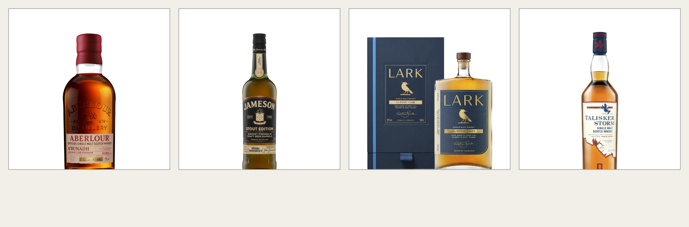
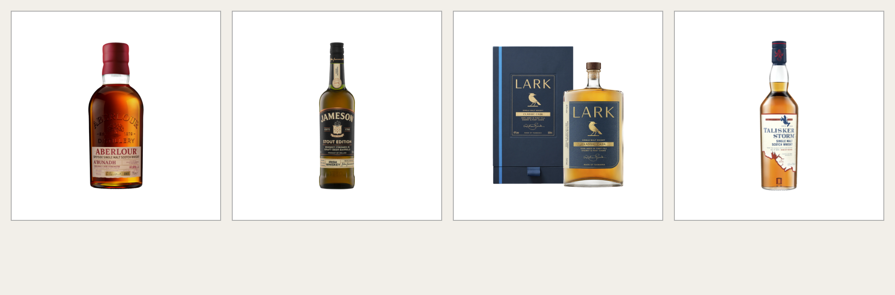

# Step 11 — the whisky bottles were not being over-scaled, they were in the wrong box

**Reported:** "My product photos are not showing in ratio" → clarified to
*cropped, tops or bottoms cut off*; then, after the first fix, "checked
staging, bottles still cut off on whisky".

**Result:** 4 of 36 whisky cards clipped before, 0 after. One CSS rule.

---

## What I got wrong first

I had read the stylesheet and `sh-bottle.js`, found a real transform-order bug
in the normaliser — it measured the recentring offset before the scale and
moved by that, leaving the bottle under-corrected by a factor of *k* — fixed
it, and shipped it as the answer. It was a real bug and it is worth keeping.
It was not what was cutting the bottles off, and the user's "still cut off"
was correct.

The mistake was reasoning about the code instead of measuring the page. The
fix only became possible once the network policy was opened to
`cdn.shopify.com`, `1312wd-hk.myshopify.com` and `www.spirithaus.com.au`, at
which point the 36 real whisky card images could be pulled down and rendered.

## What the measurement said

All 36 cards, real files, real stylesheet, real `sh-bottle.js`
(`tools/measure-cards.cjs`):

```
36 whisky cards
  clipped: 4
  normaliser left alone (no --sh-k): 26

clipped                                     natural    ground         k   bottle rows
01-903873-1.webp                            640x800    is-alpha       -   32..357 of 358
04-JamesonStoutEditionIrishWhiskey.webp     640x800    is-alpha       -   31..357 of 358
05-Lark-Classic-Cask-Single-Malt-Whisky-box 640x800    is-alpha   0.981   53..357 of 358
35-talisker-storm.png                       640x800    is-alpha       -   28..357 of 358
```

Three of the four had **no `--sh-k` at all**. The normaliser had not
over-scaled them; it had never run on them. That kills the over-scaling theory
outright — and with it my transform-order explanation.

All four are `640x800`. That is the whole pattern.

## The actual cause

`tools/probe-bottle-normaliser.cjs` splices reporting into the shipped script
and prints what each stage decided. For the one card of the four the
normaliser *did* act on:

```
E 391.5   EW 313.2   F 358   R 391.5
```

`E` is the image element's height, `F` the frame that clips it. **The image
element was 33px taller than the frame cutting it**, and 78px taller than the
square content box it was supposed to sit in.

`.sh-card__shot` is a square by `aspect-ratio: 1 / 1`. `.sh-card__img` asked
for `height: 100%` inside it. That percentage is cyclic — the container's
height is derived from its own ratio — so Chromium resolves it to `auto` and
the image keeps its natural shape. A 640x800 packshot rendered **313x392 in a
313 box**.

Then grid finished the job. When a grid item overflows its area, alignment
falls back to `start` rather than centring — so none of the 78px of excess
went out of the top. All of it left through the bottom, where
`overflow: hidden` cut it. Measured: `overflow top 0, bottom 55.9px`.

Which is exactly "bottoms cut off". The four cards, rendered through the
stylesheet as it was and as it is now:





Why only these four, when 19 other cards are also portrait-ish or full-bleed?
Because the overflow only *shows* when there is product in the rows it eats.
These four are the ones whose bottle runs edge to edge in the file
(`frac` 0.88–0.98), so the 56px came out of the bottle rather than out of
white space.

## The fix

```css
.sh-card__img {
  width: 100%;
  height: auto;
  aspect-ratio: 1 / 1;
  object-fit: contain;
}
```

`aspect-ratio` asks for the same square without a percentage that cannot
resolve, and `object-fit: contain` letterboxes the picture inside it.

Four candidates were tested against the real page geometry; only this one
works:

| candidate | portrait result |
|---|---|
| `grid-template-rows: 1fr` on the shot | still 313x392 — overflow unchanged |
| `align-self/justify-self: stretch` on the image | still 313x392 |
| `place-items: stretch` on the shot | still 313x392 |
| **`height: auto; aspect-ratio: 1/1`** | **313x313 — fits** |

The three failures all share a cause: each still leaves the used height to a
percentage or a stretch against an area the container has not definitely
sized. The wall's own idiom (`max-width/max-height: 100%; width/height: auto`)
was tested too and fails here for the same reason — `max-height: 100%` is just
as cyclic as `height: 100%`.

## What else this was breaking

The normaliser's source carries the comment *"R/E follows from the natural
aspect alone when the element is square, which the card's is"*. It was not.
Every scale the normaliser computed for a product card was derived against an
element taller than its own frame. The Lark card, before and after:

| | k | room to recentre |
|---|---|---|
| before | 0.981 | 2.4px |
| after | 1.051 | 26.4px |

It was being held nearly 7% below the common height by a fit cap defending
against a box that should not have existed.

## Not affected

`.sh-wall__img` and `.sh-rail__img` use `max-*` clamps against an intrinsic
size that already fits inside their containers, so their percentages never
have to bind. Both were measured with the same portrait file — no overflow.
`.sh-card__img` was the only rule in the stylesheet demanding `height: 100%`.

## The other finding — not a theme bug

26 of 36 whisky cards get no normalisation at all, and that is correct
behaviour, but it points at a catalogue problem:

- **18 are `256x256`** with the bottle spanning every row (`frac` = 1.000).
  Ten of them are named `icon-256-256-true-*.png`. These are icon-sized
  exports being upscaled ~22% into a 313px box: soft, and with no margin, so
  the bottle touches the card padding while its neighbours sit inset.
- **8 more** are tight crops at `frac` 0.92–0.98.

The `frac > 0.92` guard is right to leave all of these alone — there is
nothing to normalise in a file that is already full-bleed. But roughly half
the whisky grid is running on 256px source art. That is a re-export from the
supplier feed, not a theme change.

## Verification

- `measure-cards.cjs` against the repo stylesheet: **4 clipped → 0**.
- The same tool against `before.css` still reports the 4, so it fails when it
  should (exit 1) and passes when it should (exit 0).
- Re-run against **the minified stylesheet Shopify is actually serving from
  the staging theme**, with the real card markup including the `width`/
  `height` attributes the template emits: **0 clipped**.
- Theme checks: `schema-lint.py`, `css-check.mjs`, `age-gate.test.mjs`
  (12/12), `hover-touch.test.mjs` — all green.
- Staging theme `assets/spirithaus.css` is 105,647 bytes, byte-identical to
  the repo, synced 7 seconds after the push.

## Shipped

`spirithaus-theme` `claude/card-shot-square-box` → `staging`
(`3b5fa97`, merged as `197d6b1`). Live on the staging theme; not yet on
`main`.
